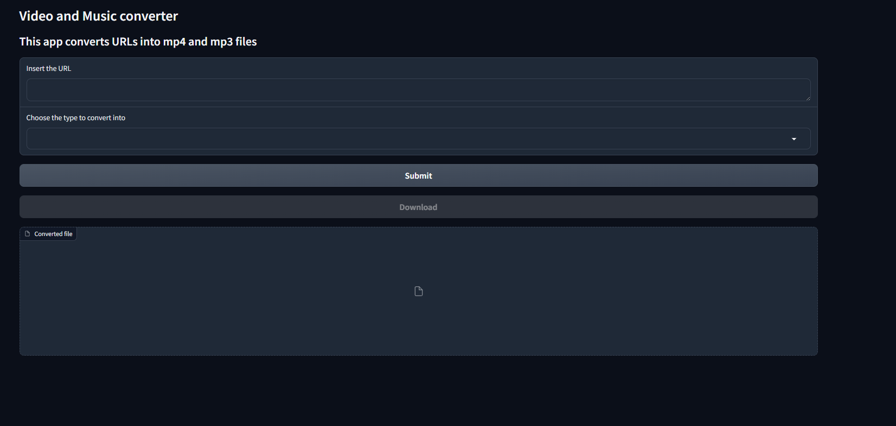

# video_music_downloader

## Description

This is a simple python script that downloads videos from youtube and converts them to other type of files (mp4, mp3, mov, ...). It uses the youtube-dl and moviepy libraries.

## Note

After the download is complete, the video will be converted to the desired format. The conversion process may take a while depending on the size of the video.
Note that it might give an error, but it will still work. The error is due to the fact that the video is still being converted. You can check the output folder to see if the file is there.

## Improvements

- [ ] Make the process asynchronous

## Requirements

python >= 3.9

To run the project, you need to have Python installed on your machine. You can download Python from the [official website](https://www.python.org/downloads/)

**Setting Up the Environment**

* Windows: `./setup_Windows.bat`
* Linux/macOS: `./setup_Linux.sh`

These scripts will install required dependencies, and build a virtual environment for you if you don't have one.

## Usage

Before running the application, you need to insert the text you want to use as input in the `data/input.txt` file.
Run the following command to start the application:

```bash
cd bin
python ./interface.py
```

How the interface looks like:



## License

This project is licensed under the MIT License - see the [LICENSE](LICENSE) file for details.

## Author

[Neetre](https://github.com/Neetre)
